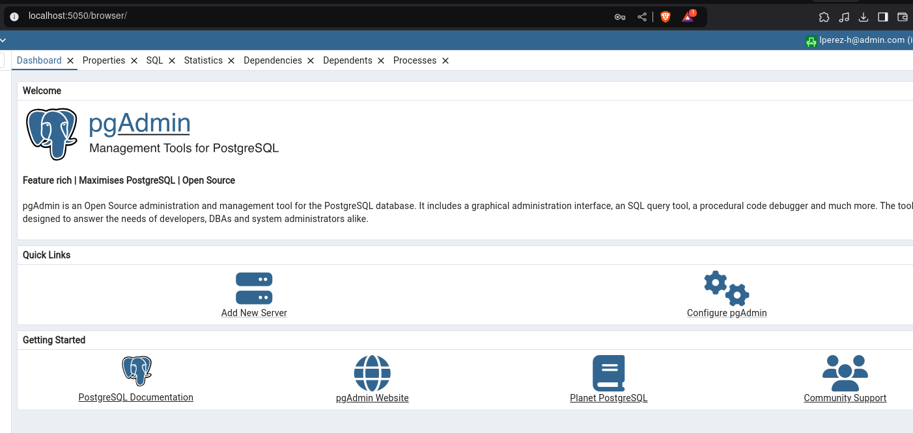

# Data-Science-Piscine

The goal if this piscine is to get exposed to different challenges in the data field according to the role: Data Engineer, Data Warehouse, Data Scientist.

## Day 1
In the first day the challenge is to create a PostgreSQL Database and populate it with data stored in a csv file, these csv files are big and saving those files into the database without thinking in an optimization strategy for saving the data, may be computationally expensive 😿 (this is one of the main challenges of the exercise.)
For the script I used python since i want to get in touch again with it after long time, another powerfull option to consider is to use a bash script 🚀 and process the data in chunks of x amount of rows, this should do the work 😉

The setup used to develop this project is a Docker Compose in which we have 2 services: a PostgreSQL Database and a pgAdmin to use as front-end of our Database and query the data. 

To build the project run `make up` be aware that you may need to create your own environment variables and put the csv files to process and load into your folder before running the make up command.

After building the image the frontend should look like this:

From here, we connect the database and then it should be ready to create tables on it to store and retrieve data as needed. 

## Day 2
In the second day the challenge is to build a pipeline ETL process in which we need to join the previously loaded csv files and merge then into a single file considering removing the duplicates values. 

Like always you give a look to the task and think it's easy, the challenge here are:

 - Load the csv files into the DataBase and realize that using pure python will take some time even when we're working with csv files. -> for this one I'll be using a bash script and inside of it will be runing some SQL statement, for each csv file will create a unlogged table to improve the write performance and have less total WAL (Write Ahead Log). To create the tables run `make create` this will call the docker running with the postgresql and redirect the bash script to it for execution 🤖
 - Another challenge is  to deduplicate the customers table, some events may have a 1 second delay between rows due to the server signaling, so we would have the same event happening twice with 1 second of difference between them. -> for this one we may want to use our old and feared friends Window Function and Common Table Expressions 😨. 
 Since there was some delay between events I want to use LAG in the event_time colum and use the OVER statement in the other values to make sure I'm getting more unique records, we filter this result afterwards extracting the difference between events of 1 second. To deduplicate tables run `make customer`
 - The items table also have their own problem, there are rows that have some missing values for the same product_id and we need to decide how to deduplicate this table to join it later on with the customers. -> For this one we use a simple left join but inside of it we select uniques product_id. To fusionate the tables customers and items run `make fusion`

 ## Day 3
 In the second day after we have a clean and unified Dataset, then we're ready to do a first exploratory analysis of the data, the main goal of the module is to be on the shoes of a Data Analyst and generate some graphs. 

 To generate the graph I'll keep working with **polars** since I really like the power on it and would like to master the tool. In top of that I'm using seaborn, plotlib and hvplot.
